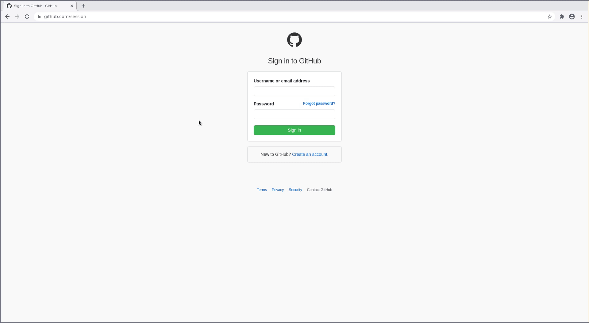
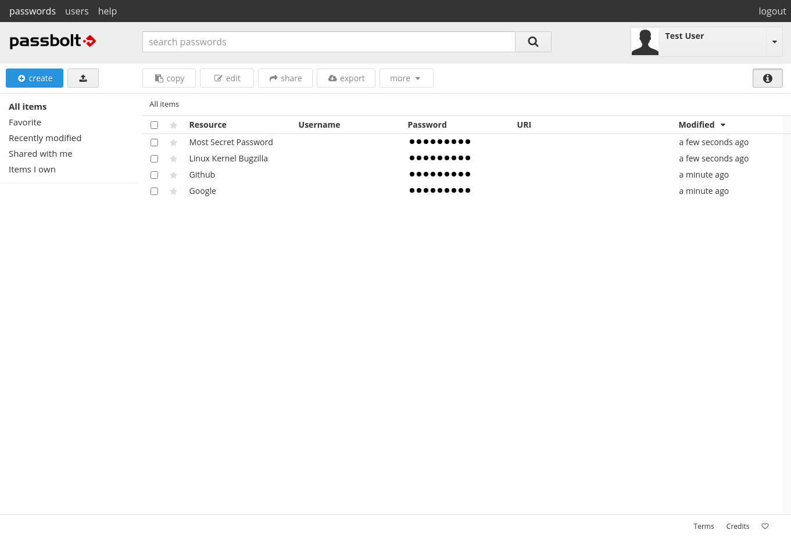
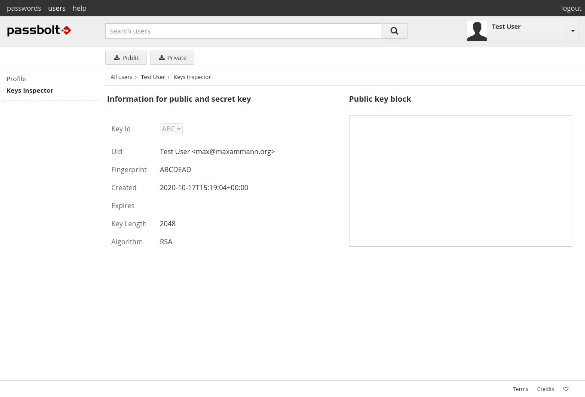
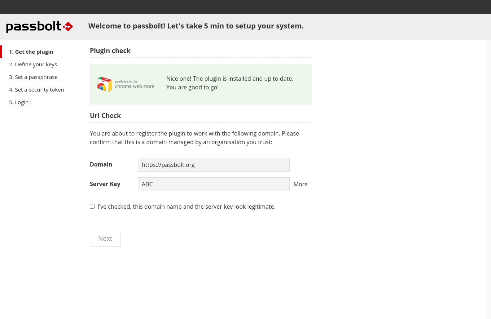
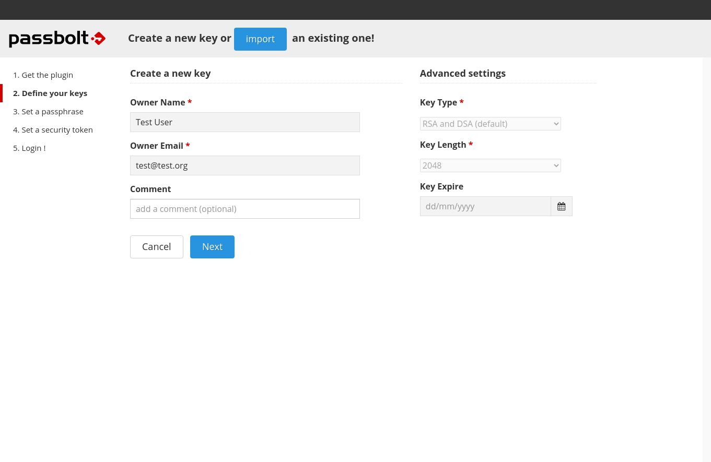
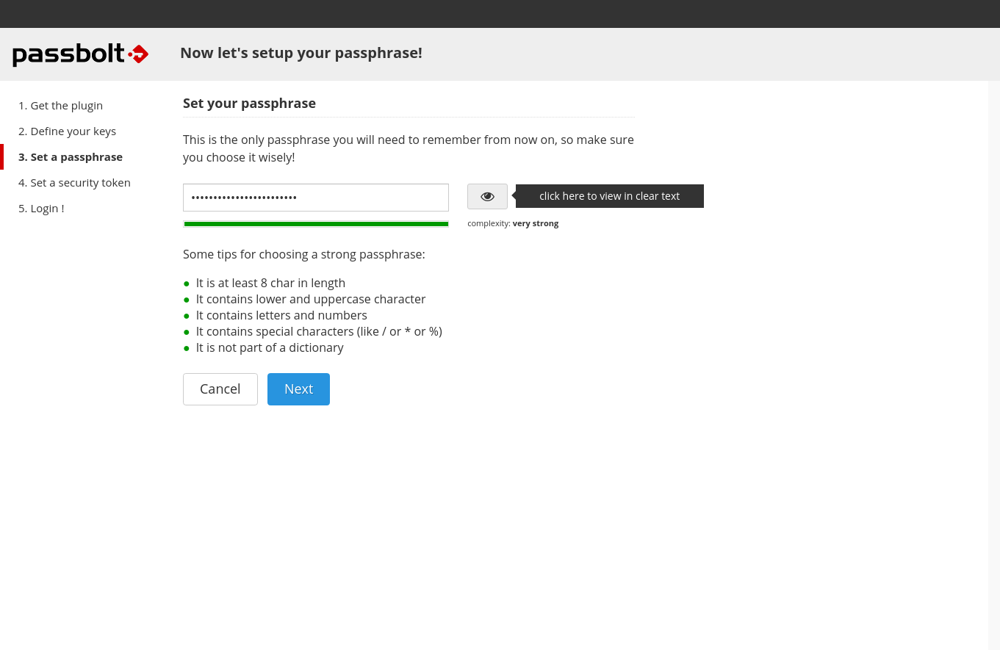
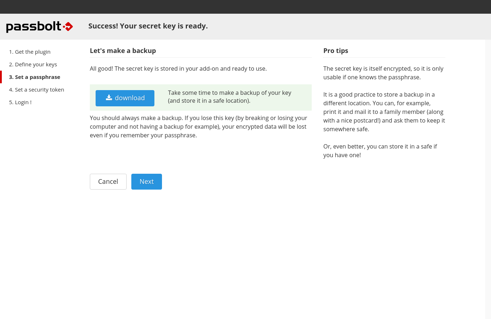

# rofi-passbolt
> I have to login that often!

rofi-passbolt is a [](https://github.com/davatorium/rofi) mode to access passbolt. It is fast, has a minimal code footprint and is written in Go. This is not a set of bash scrips which handle your secrets, but a shared library which is loaded by rofi.



## Dependencies

* xdotool
* Go

## Building

Run the following commands:

```console
$ go build -buildmode=c-shared -o dist/rofi-passbolt.so 
```

## Setup

### Use an existing account

1. After setting up a few passwords click on your profile in the upper right corner. Then select "Key inspector" on the left.

2. Copy the Fingerprint. This will be needed later on.


Place the `passbolt_private.txt` file you downloaded in `~/.config/rofi/passbolt`.

### Setting up a new account
1. Follow the invite link in our email:

2. Confirm the shown data

3. Choose a key password which will be required later on.

4. Download the key backup. This will also be needed later on.

5. Choose a random color.


Follow the [Use an existing account](#use-an-existing-account) guide.

## Installation

Then you can copy the `rofi-passbolt.so` file to a custom rofi plugin directory like `~/.config/rofi/plugins` or place it in `/usr/lib/rofi/`. If you place it in the former location then you always need the parameter `-plugin-path ~/.config/rofi/plugins` when invoking rofi.


## Usage

There are multiple ways how to use it. One way is to create a script which will start rofi.
Create a script called `passbolt.sh` in a directory of your choice like `~/.bin` with the following content:

```bash
#!/bin/bash
ROFI_PLUGIN_DIR=~/.config/rofi/plugins

BASE_URL=https://passbolt.org
FINGERPRINT=ABCD
GPG_KEY_PATH=~/.config/rofi/passbolt/passbolt_private.txt
KEY_PASSWORD=$(cat ~/.config/rofi/passbolt/key_password.txt) # If you are using pass you can use here $(pass passbolt | head -n 1)

PASSBOLT_GPG_KEY_PASSWORD=$KEY_PASSWORD rofi -plugin-path $ROFI_PLUGIN_DIR -show passbolt -fingerprint $FINGERPRINT -gpg-key $GPG_KEY_PATH -base-url $BASE_URL
```
Replace the correct values for `BASE_URL`, `FINGERPRINT`, `GPG_KEY_PATH` and `KEY_PASSWORD`. The base URL is the URL to your passbolt server. The fingerprint can be acquired when you are logged in (See [Use an existing account](#use-an-existing-account)). `GPG_KEY_PATH` should be the locatin of your key backup. The `KEY_PASSWORD` is the password you use to login in your browser.

Then you can setup your keyboard shortcut service of choice. In the case of i3 you can add the following to your config:

```i3
bindsym $mod+P exec --no-startup-id ~/.bin/passbolt.sh
```
